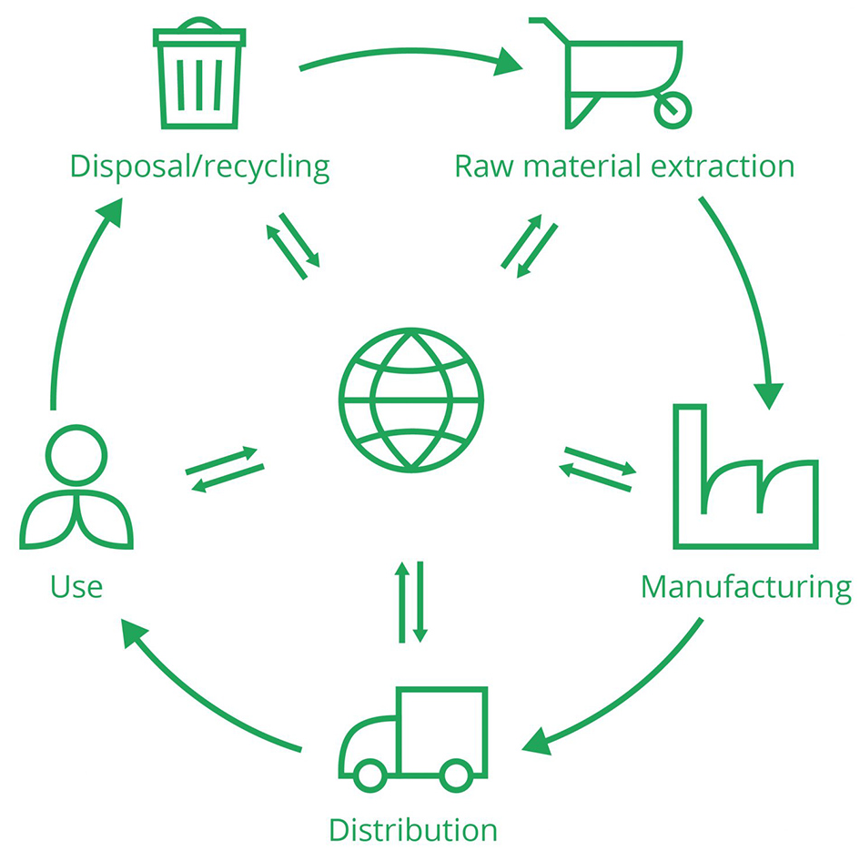
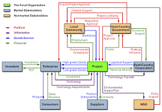
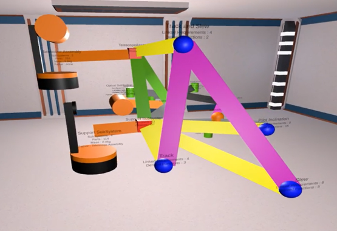
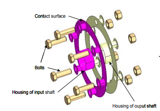

# Benchmarks in Design Research 

We observe that design research has come very far after several decades of development. Nevertheless, there is still room for improvement. Such improvements must be well documented and fairly evaluated. Time is over for making claims like “results seem to be better than existing ones from the literature”. We are responsible for making quantitative judgments and fair comparisons to the state of the art.

We may think that the validation of design research is much more complicated than the validation of computer science research. Still, arguments such as " *we would need several years to get evidence*", "*our design situation is really special*", "*we cannot replicate the simulation results as we do not have the computing resources*" are no different from other disciplines. For instance, climate research, a discipline that requires more computing resources to solve research questions on highly complex situations and over a very long period, created the [Coupled Model Intercomparison Project 6 (CMIP6)](https://pcmdi.llnl.gov/CMIP6/), which has been internationally adopted as a shared infrastructure that serves as the provision of benchmarks against which to compare improvements in models and prediction quality. The same when researchers argue that "*the influence of designers' knowledge is too important to get comparable results*"; disciplines like Human-Computer Interaction are facing the same challenges but try to adopt the scientific method.

This version-controlled and community-based open science platform is a collaborative space gathering benchmarks of engineering design theories, processes, methods and tools. Each benchmark is a sustainable ecosystem where a community of researchers can engage in an asynchronous collaboration for 1/the co-definition of fundamental and practical research problems, goals and solutions, 2/ the fair and systematic evaluation of claimed contributions on open benchmark exercises following standardised measurement protocols, and 3/ the comparison of competing solutions based on agreed-upon qualitative or quantitative measures of performance aligned with research goals.

## **What is a scientific benchmark?**

*The "What" and "Why" of Scientific Benchmarks are mostly extracts from the paper ''[Using benchmarking to advance research: a challenge to software engineering](https://10.1109/ICSE.2003.1201189)'' (Sim, 2003).*

Researchers commonly communicate their research results in papers. Often, a wide variety of research papers address the same research topic. It is becoming increasingly hard to compare research results by reading papers. Why? Because it is hard to compare results if the metrics, protocols, datasets and ground truth differ. Benchmarking in the form of organising challenges (the terminology for this differs per field, from *competitions*, *benchmarking*, *shared or common tasks*, etc.) is one way to address this. In this case, a benchmark is a standardised validation framework that allows for the direct comparison of different solutions that address the same research problem. Participants are invited to submit their solutions to a benchmark, after which their submissions are assessed using a predefined set of evaluation criteria.

A scientific benchmark is more than a dataset or set of datasets composed of tests and metrics used to compare the performance of alternative tools or techniques. A benchmark operationalises a paradigm; it takes an abstract concept and makes it concrete so it can serve as a guide for action. Indeed, within research communities, benchmarks are a statement of the discipline's research goals, and they emerge through a synergetic process of technical knowledge and social consensus proceeding in tandem. This community-based open science platform is concerned primarily with benchmarks created and used by a technical research community, especially the design research community.

Benchmarking has a strong positive effect on a discipline's scientific maturity. It helps whenever a research area needs to become more scientific, codify technical knowledge, or become more cohesive. Appropriately deployed benchmarking is not about winning a contest but more about surveying a landscape — the more we can reframe, contextualise, and appropriately scope the datasets, the more useful they will become as an informative dimension.

Scientific benchmarks emerge through a process of scientific discovery and consensus. Both must progress together for a standard benchmark to emerge because neither alone is sufficient. The community of interest may include academia, industry, and government participants, but they are all primarily interested in scientific research. The benchmark should be specified at a high enough level of abstraction to ensure that it is portable to different tools or techniques and does not bias one technology in favour of others. Continued evolution of the benchmark is necessary to prevent researchers from making changes to optimise the performance of their contributions on a particular set of tests.

## **Motivations for Engaging in Design Research Benchmarking**

During the last decades, our community of researchers in engineering design has reached a general consensus:

<blockquote> "As foundation of good scientific practise, manuscripts submitted for publication must advance the state of the art and provide novel theoretical, numerical or mechanical insight and knowledge. Sometimes, good ideas turn out to be not as good as initially expected, i.e., the initial research hypotheses or promises turn out not to hold. This is no shame and in fact learning from other researches’ mistakes or failed attempts may be just as fruitful as learning from successes and may save a lot of time. Unfortunately, however, many manuscripts set out with high goals and claims but fail to critically evaluate the outcome at the end." [Sigmund, 2022]
</blockquote>
<blockquote> "Real progress on evaluating design methods can only be expected if preconditions such as standardized theoretical constructs, measures, data bases of empirical data, and a sufficient number of studies on specific design methods are developed." [Hein and Lamé, 2020]</blockquote>
  <blockquote> "Without action to increase scientific, theoretical, and methodological rigour there is a real possibility of the field being superseded and becoming obsolete through lack of impact." [Cash, 2018]</blockquote>
  <blockquote> "There is this concern that design research does not live up to the standards of science: it is creating in a sense too many theories and models, which jeopardises the coherence of the discipline and which indicates that design research does not yet have the means to test and refute design theories and models." [Vermaas, 2014] </blockquote>
  <blockquote> "There is in design research a general concern about the quality of the testing of design theories and models. In work reflecting on the results that design research has produced, it is complained that generally accepted and effective research methods for testing design theories and models are lacking in design research, and that the discipline is fragmented in separate research strands.” [Vermaas, 2014]</blockquote>
  <blockquote> “37% of the articles reviewed did not have any validation. There needs to be more validation in the field of research in engineering design.” [Barth, A. et al. 2011]</blockquote>
  <blockquote> “A lack of common terminology, benchmarked research methods, and above all, a common research methodology are the most outstanding problems in the field.” [Blessing and Chakrabarti, 2009]</blockquote>

Two conditions must already exist within a discipline before the construction of a benchmark can be fruitfully attempted. Design research is at a stage where scientific benchmarks can be fruitfully attempted. Design research is being established, and diverse approaches and solutions proliferate. This proliferation is desirable, so there are various tools and techniques to be compared by the benchmarks. Evidence that our community has reached the required level of maturity and is ready to move to a more rigorous scientific basis comes in many forms. Typical symptoms include an increasing concern with the validation of research results and with a comparison between solutions developed at different laboratories, attempted replication of results, use of proto-benchmarks (or at least attempts to apply solutions to a common set of sample problems), and finally, increasing resistance to accepting speculative papers for publication. This precondition is important because there is a significant cost to developing and maintaining scientific benchmarks and a danger in committing to a benchmark too early.

Scientific benchmarks advance a discipline by improving the science and increasing the cohesiveness of the community. The research design community is sufficiently well-established and has a culture of collaboration. Evidence of the former includes an existing collection of diverse research results and an increasing concern in validating these results. Evidence of the latter includes multi-site research projects, multi-author publications, standards for reporting, file formats, and the like. From this base, a consensus-based process led by a few key researchers can be used to construct benchmarks endorsed by the design research community. Using benchmarks results in a more rigorous examination of research contributions and an overall improvement in the tools and techniques being developed.  The presence of benchmarks will state that the design research community believes that contributions ought to be evaluated against clearly defined standards. We want the design research community to become more scientific and cohesive by working as a community to define benchmarks to advance the state of research. 

The benchmark itself promotes collaborative, open, and public research. Creating a benchmark requires our community to examine our understanding of the field, agree on the key problems, and encapsulate this knowledge in an evaluation. Throughout the benchmarking process, greater communication and collaboration among different researchers lead to a stronger consensus on the community's research goals and methods.

Although some research (e.g., computer science research) is more obviously amenable to benchmarking because the performance measures are straightforward, no dataset will be able to capture the full complexity of the details of existence,

Benchmarking is far superior to merely asserting that a design theory, process, method or technology is valuable. No research method or empirical evaluation is perfect. Benchmarks are one of the few ways that the dirty details of research, such as debugging techniques, design decisions, and mistakes, are forced out into the open and shared between laboratories. Like experiments, control of the task sample reduces variability in the results—all tools and techniques are evaluated using the same tasks and experimental materials. Another advantage of benchmarking is that replication is built into the method. Since the materials are designed to be used in different laboratories, people can perform the evaluation on various tools and techniques repeatedly, if desired.

The second precondition is that there must be an ethos of collaboration within the community. In other words, there must be a willingness to work together to solve common problems. 

### Why should we collaborate and open our research data?

Design research is interdisciplinary, and using multiple research methods is difficult. Literature reviews drew up extensive lists of research methods (Barth et al., 2011; Escudero-Mancebo et al., 2023) and design research objectives (Eckert et al., 2004; Cantamessa, 2003). When mixing research methods from multiple research areas, many challenges can arise due to the individual research cultures of each discipline involved.

Collaboration in benchmarking occurs in two ways. During development, researchers work together to build consensus on what should be in the benchmark. During deployment, the results from different design philosophies, processes, methods, [...] and tools are compared, which requires researchers to look at each other’s contributions. Consequently, researchers become more aware of one another's work and ties between researchers with similar interests are strengthened. Evaluations carried out using benchmarks are, by their nature, open and public. The materials are available for general use, and often so are the results being tested. It is difficult to hide the flaws of a tool or technique or to aggrandise its strengths when there is transparency in the test procedures. Moreover, anyone could use the benchmark with the same tools or techniques and attempt to replicate the results. Together with collaboration, openness, and publicness, these factors result in frank, detailed, and technical communication among researchers. This kind of public evaluation contrasts sharply with the descriptions of tools and techniques currently found in design research conferences or journal publications.

Publishing or making our data available to others is not considered standard practice. As measured by the [French Open Science Barometer](https://barometredelascienceouverte.esr.gouv.fr/donnees-de-la-recherche/disciplines?id=disciplines.partage), researchers in design science keep their results more confidential than other disciplines, with only 10 % of French publications in engineering which mention the sharing of their data and 15% that include a "Data Availability Statement" between 2013 and 2021, whereas 86 % of French publications in engineering mention the use of data. This lack of openness is all the more regrettable, given that the opening up of data forces researchers to guarantee data quality. We may assume that it is mainly because we are primarily focused on getting grant money, and the influence of outside sponsors, such as industrialists, limits the openness of research data. Still, it is necessary to open our research data to a scientific community that examines the same research question from multiple angles over time because more than one data collection effort is needed to lead to a definitive answer. Research methods and results should be well documented, with enough detail so that other teams can attempt to reproduce or replicate the findings and expand upon them. If they come up with the same general results over time, all of these efforts give evidence for the scientific truth of the findings. Benchmarks are an opportunity to share open data that serves as ground truth.

## Goals

*What does this project provide?*

This open science project has been born and developed to make a move for the industrial engineering research community's progress.

## News

*What's new?*

- 20/05/2024 - 18th International Design Conference "*Operationalizing Community-Based Open Scientific Design Research Benchmarks: Application to Model-Based Architecture Design Synthesis*". [Slides]() [Paper]()

- 04/04/2023 - Animation of the workshop *"Co-design of a community-based ecosystem to improve validation practices in engineering research”*, S.mart Special Interest Group in Industry 4.0. [Slides](./Papers/20230404%20-%20S.mart%202023.ppsx) 
- 08/12/2022 - Benchmarking in design research workshop at the Academia-Industry forum of the INCOSE French chapter (AFIS). [Slides](./Papers/20221208%20-%20Atelier%20bencharking%20V%26V%20(RP%2BLR)%20VF.ppsx) 
- 21/06/2022 - Meeting of French academics whose research concentrates on systems engineering.  Part of the researchers decided to start two working groups so as to develop two benchmarks: 1) Model-based system architecture synthesis; 2) Early validation and verification of systems. [Lettre](./Papers/20220621%20-%20Lettre%20cadrage%20WG%20Smart-RIIS.pdf)
- 28/03/2022 - 32nd CIRP Design Conference "An Open Science Platform for Benchmarking Engineering Design Researches." [Slides](https://docs.google.com/presentation/d/18vPTcx-UZ0YA693My-BFH3r0QysgSu14A6MB5k_A1io/edit#slide=id.g119d74bd765_0_0) [Paper](https://reader.elsevier.com/reader/sd/pii/S2212827122007296?token=701B77CB1721C15BFFCB63DE273BB96BB4CCF394FCFCB04DB6002765981951A6D83601E4574B1B1EFB15A3F198155D74&originRegion=eu-west-1&originCreation=20221102174823)
- 31/03/2021 - Atelier S.mart "*Validation de nos recherches en Génie Industriel : Co-Construction d'une Feuille de Route.*" [Dashboard](https://miro.com/app/board/o9J_lOfryN8=/) [Notes](./Papers/20210331-Notes%20_Colloque_Smart.pdf)
- 28/01/2021 - Webinar S.mart "Méthodologies de recherche sur l'industrie du futur: Pourquoi et Comment ? [Replay](https://videos.univ-grenoble-alpes.fr/video/21692-webinar-smart-validation-des-recherches-en-conception/) [Slides](./Papers/20210324-Slides.pdf) [Notes](./Papers/20210324-Webinar_smart_validation_framapad.pdf)

## Contribution Process

_*Willing to be active with us? Follow the [contributing guide](./Docs/contributing.md)!*_

## Code of Conduct

This code of conduct outlines expectations for participation in this Open Source Benchmarking Environment for Engineering Research. By joining our community, you pledge to act and interact in ways that contribute to an open, welcoming, diverse, inclusive, and healthy community by:
- Being radically inclusive to existing members and newcomers looking to learn or participate.
- Being totally respectful of each others abilities, interests, viewpoints, experiences and personal differences.
- Gracefully accepting constructive criticism and being exceedingly kind even in moments of disagreement while working towards consensus.
- Educating and illuminating others with something you know more about.
- Contacting the original contributors before any external communication.
- Preventing any public or private business opportunities of the open source content without agreeing with the original authors and contributors of the sources.

**People violating this code of conduct may be banned from the community.**

## Benchmarks

The open science benchmarking environment contains a set of benchmarks that aim at making technical progress objective and reproducible.

<table>
<tbody>
<td></td>
<td>
<h2><a href="https://github.com/GIS-S-mart/Benchmark-1_Model-Based_Systems_Engineering_for_Validation_and_Verification">Model-Based Systems Engineering for Early V&V </a></h2>

    
Benchmark methods and tools for the early validation and verification of engineered systems.

<strong>Keywords</strong>: MBSE, Validation, Verification

<strong><a href="https://github.com/GIS-S-mart/Benchmark-1_Model-Based_Systems_Engineering_for_Validation_and_Verification/discussions/new?category=announcements&welcome_text=true">Discussions </a> - <a href="https://github.com/GIS-S-mart/Benchmark-1_Model-Based_Systems_Engineering_for_Validation_and_Verification/issues"> Open Issues </a>
</td>
</tbody>
<tbody>
<td></td>
<td>
<h2><a href="https://github.com/GIS-S-mart/Benchmark-2_3D_modelling_in_VR">3D modelling in Virtual Reality </a></h2>

Benchmark methods and tools for 3D modelling in virtual reality.

<strong>Keywords</strong>: Virtual Reality, Geometric Modelling, CAD

<strong><a href="https://github.com/GIS-S-mart/Benchmark-2_3D_modelling_in_VR/discussions">Discussions </a> - <a href="https://github.com/GIS-S-mart/Benchmark-2_3D_modelling_in_VR/issues"> Open Issues </a>
</td>
</tbody>
<tbody>
<td></td>
<td>
<h2><a href="https://github.com/GIS-S-mart/Benchmark-4_Sustainability_Competences_LCA">Ability to conduct Life Cycle Assessment in Education</a></h2>

Identify the most suitable Life Cycle Assessment method for a teaching population.

<strong>Keywords</strong>: Life cycle analysis, Sustainability, Competencies Evaluation

<strong><a href="https://github.com/GIS-S-mart/Benchmark-4_Sustainability_Competences_LCA/discussions">Discussions </a> - <a href="https://github.com/GIS-S-mart/Benchmark-4_Sustainability_Competences_LCA/issues"> Open Issues </a>
</td>
</tbody>
<tbody>
<td></td>
<td>
<h2><a href="https://github.com/GIS-S-mart/Benchmark-3_Stakeholder_integration_in_DfS_complex_systems">Measure the value provided to stakeholders in design for sustainability</a></h2>

Benchmark to compare different approaches for measuring the value perceived by the stakeholders: ecosystems, territorial approaches, value analysis approaches, etc.

<strong>Keywords</strong>: Value, Sustainability, Stakeholders

<strong><a href="https://github.com/GIS-S-mart/Benchmark-3_Stakeholder_integration_in_DfS_complex_systems/discussions">Discussions </a> - <a href="https://github.com/GIS-S-mart/Benchmark-3_Stakeholder_integration_in_DfS_complex_systems/issues"> Open Issues </a>
</td>
</tbody>
<tbody>
<td></td>
<td>
<h2><a href="https://github.com/GIS-S-mart/Benchmark-6_model-based-design-reviews">Model-Based Design reviews</a></h2>

Open benchmark exercises for comparing digital materials supporting model-based design reviews.

<strong>Keywords</strong>: Model-Based Design, Design review

<strong><a href="https://github.com/GIS-S-mart/Benchmark-6_model-based-design-reviews/discussions/new?category=announcements&welcome_text=true">Discussions </a> - <a href="https://github.com/GIS-S-mart/Benchmark-6_model-based-design-reviews/issues"> Open Issues </a>
</td>
</tbody>
<tbody>
<td></td>
<td>
<h2><a href="https://github.com/GIS-S-mart/Benchmark-7_Design_synthesis-3_Concepts_finding">Model-Based Architecture Design Synthesis</a></h2>

Open benchmark exercises for comparing concept finding in a model-based design synthesis process for system sizing.

<strong>Keywords</strong>: Model-Based Design Synthesis, Concept Finding, System Sizing

<strong><a href="https://github.com/GIS-S-mart/Benchmark-7_Design_synthesis-3_Concepts_finding/discussions/new?category=announcements&welcome_text=true">Discussions </a> - <a href="https://github.com/GIS-S-mart/Benchmark-7_Design_synthesis-3_Concepts_finding/issues"> Open Issues </a>
</td>
</tbody>
<tbody>
<td></td>
<td>
<h2><a href="https://github.com/GIS-S-mart/Benchmark-8_MBSE_Model_transformation_inference">MBSE Model Transformation Inference</a></h2>

Open benchmark exercises to compare and study the performance of approaches for automatically inferring a transformation model.

<strong>Keywords</strong>: Model-Based Design Synthesis, Concept Finding, System Sizing

<strong><a href="https://github.com/GIS-S-mart/Benchmark-8_MBSE_Model_transformation_inference/discussions/new?category=announcements&welcome_text=true">Discussions </a> - <a href="https://github.com/GIS-S-mart/Benchmark-8_MBSE_Model_transformation_inference/issues"> Open Issues </a>
</td>
</tbody>
</table>

## Project Lead

* Romain Pinquié - Univ. Grenoble Alpes, CNRS, Grenoble INP, G-SCOP - romain.pinquie@grenoble-inp.fr {Git ID: [rpinquie](https://github.com/rpinquie)}

## Project Team

_*These were the original creators of this project. Want to contact the Core Team? Send an e-mail to all of them!*_
* Romain Pinquié - Univ. Grenoble Alpes, CNRS, Grenoble INP, G-SCOP - romain.pinquie@grenoble-inp.fr {Git ID: [rpinquie](https://github.com/rpinquie)}
* Lionel Roucoules - Arts et Métiers ParisTech, LISPEN - lionel.roucoules@ensam.eu {Git ID: [roucoules](https://github.com/roucoules)}
* Lou Grimal - Université de Technologie de Troyes, InSyTE, CREIDD - lou.grimal@utt.fr {Git ID: [LouGrimal](https://github.com/LouGrimal)}
* Raphaël Chenouard -  École Centrale de Nantes, LS2N, France - raphael.chenouard@ls2n.fr {Git ID: [raphaelchenouard](https://github.com/raphaelchenouard)}
* Pierre-Alain Yvars - ISAE-Supméca, Quartz, France - pierre-alain.yvars@isae-supmeca.fr 

## Other Participants

Volunteers run this open-science repository. Below is a list of volunteers who have expressed an interest in this project. 

* Julien Le Duigou - Université de Technologie de Compiègne, Roberval - julien.le-duigou@utc.fr {Git ID: [jleduigo](https://github.com/jleduigo)}
* Nabil Anwer - ENS-Paris-Saclay, LURPA - nabil.anwer@lurpa.ens-cachan.fr
* Matthieu Bricogne - Université de Technologie de Compiègne, Roberval - matthieu.bricogne@utc.fr
* Alexis Lalevée - Université de Technologie de Troyes, ICD - alexis.lalevee@utt.fr
* Florent Laroche - Ecole Centrale de Nantes, IS2N - florent.Laroche@ec-nantes.fr
* Olivia Penas - Supméca, QUARTZ - olivia.penas@supmeca.fr
* Régis Plateaux - Supméca, QUARTZ - regis.plateaux@supmeca.fr
* Alix Thecle - Arts et Métiers ParisTech, IMS - Thecle.alix@ensam.eu 
* Nadège Troussier - Université de Technologie de Troyes, ICD - nadege.troussier@utt.fr
* Esma Yahia - Arts et Métiers ParisTech, LISPEN - esma.yahia@ensam.eu
* Gilles Foucault - Université Grenoble Alpes, G-SCOP - gilles.foucault@univ-grenoble-alpes.fr {Git ID: [gilles-foucault-univ](https://github.com/gilles-foucault-univ)}

 If you want to be an active member of our community, open a new issue.

## Related Projects

*What are the existing sources that have inspired this project?*

* Open science:
  - [DATACC](https://www.datacc.org/)
  - [Top 10 reasons to NOT share your code (and why you should anyway)](https://faculty.washington.edu/rjl/talks/LeVeque_CSE2011.pdf)
  - [How to describe data before publication](https://www.datacc.org/vos-besoins/documenter-ses-donnees/metadonnees/)
  - [Déposer ses données en ligne : où et comment ?](https://www.datacc.org/vos-besoins/valoriser-ses-donnees/deposer-ses-donnees-en-ligne-ou-et-comment/)
  - [OSF](https://osf.io/)
  - [Ouvrir la science](https://www.ouvrirlascience.fr/)
  - [OpenAIRE Nexus project](https://www.openaire.eu/openaire-nexus-project)
  - [DoRANum](https://doranum.fr/)
  - [Guide de bonnes pratiques sur la gestion des données de la recherche](https://mi-gt-donnees.pages.math.unistra.fr/guide/guide_bonnes_pratiques_gestion_donnees_recherche_v2.pdf)
* Open data repositories:
  - [Software Heritage](https://www.softwareheritage.org/)
  - [Archive Ouverte HAL](https://data.archives-ouvertes.fr/)
  - [Zenodo](https://zenodo.org/)
  - [4TU.ResearchData](https://data.4tu.nl/info/en/)
  - [B2SHARE](https://eudat.eu/catalogue/B2SHARE)
  - [B2DROP](https://eudat.eu/catalogue/B2DROP)
  - [Harvard Dataverse](https://dataverse.harvard.edu/)
* Systems Engineering:
  - [Thermostat, flight control system, flight guidance system, autopilot of the FAA Requirements Engineering Management Handbook](https://www.faa.gov/aircraft/air_cert/design_approvals/air_software/media/ar-08-32.pdf)
  - [The generic infusion pump](https://rtg.cis.upenn.edu/gip/)
  - [OMG MBSE Methodology and Metrics](https://www.omgwiki.org/MBSE/doku.php?id=mbse:methodology)
  - [The landing gear case study: challenges and experiments](https://hal.science/hal-01851720/document)
  - [AIR6110 Wheel brake system case study](https://es-static.fbk.eu/projects/air6110/)
* Model-Based Systems Engineering:
  * [DELLSAT-77 satellite system](https://ei194.infusionsoft.app/app/page/free-sysml-model?cookieUUID=1b4bc2ec-68a1-4215-bafe-1d6e877fe65f)
  * [Spacecraft system](http://sysml-models.com/)
  * [Drug delivery autoinjector system](https://web.mst.edu/~cornss/incose/On-LineModel/DrugDeliveryModel22Feb2013.html)
  * [Aircraft inspection and drone assistant system](https://sahara.irt-saintexupery.com/AIDA)
  * [GFSE Telescope](https://www.gfse.de/images/mbse/telescope/ape.html)
  * [Thirty Meter Telescope](https://github.com/Open-MBEE/TMT-SysML-Model)
  * [Harmony aMBSE Deskbook Models](https://wix.anyfileapp.net/dl?id=553246736447566b58312b37447a75486c35332f6e6c346c447a4e627a764b3070725259547138585835464e6936476951363866596c695a364743504639493045794c53614a516c534a705368774477414636702f773d3d)
  * [Hubble space telescope system](https://github.com/DROUINRemy/hubble-capella-sample)
  * [Model-Based STPA](https://github.com/DLR-FT/ModelBasedSTPA)
* Additive Manufacturing:
  - [AM Bench 2022 Challenge Problems and Measurement Results](https://www.nist.gov/ambench/am-bench-2022-challenge-problems-and-measurement-results)
* Artificial Intelligence applied to Engineering Design:
  - [MIT Design Computation and Digital Engineering (DeCoDE) Lab](https://decode.mit.edu/)
  - [PHYRE A Benchmark For Physical Reasoning](https://phyre.ai/#tasks)
* Computer science challenges:
  - [Semantic Textual Similarity Wiki](http://ixa2.si.ehu.eus/stswiki/index.php/Main_Page)
  - [ICLR Reproducibility Challenge](https://reproducibility-challenge.github.io/iclr_2019/)
  - [The EPFL Combinational Benchmark Suit](https://github.com/lsils/benchmarks)
  - [Bencharmks for optimization software](https://plato.asu.edu/bench.html)
  - [The official benchmark set of MIPLIB 2017](https://miplib.zib.de/tag_benchmark.html)
* Data science public challenges:
  - [Kaggle](https://www.kaggle.com/competitions)
  - [Codabench](https://www.codabench.org/)
  - [Challenge Data ENS](https://challengedata.ens.fr/) 
  - [Hackatons](https://www.hackateam.com/fr/challenges)
* Topological optimization:
  - [Aircraft wing design](https://data.dtu.dk/collections/TopWing_Data/5043437/1)
  - [Suspension bridge](https://data.dtu.dk/collections/TopWing_Data/5043437/1)
* Shape retrieval:
  - [Princeton shape retrieval and analysis group](https://gfx.cs.princeton.edu/proj/shape/)
  - [Shape retrieval contest for CAD models](https://engineering.purdue.edu/PRECISE/shrec08)
  - [3D shape retrieval challenge](https://www.shrec.net/)
* Model exchange:
  - [OMG Model Interchange Wiki](https://www.omgwiki.org/model-interchange/doku.php)
  - [The NIST Validator](http://validator.omg.org/se-interop/tools/validator)
* Multimedia evaluation:
  * [Multimedia Evaluation Benchmark](https://multimediaeval.github.io/)

* Social science:
  * [Fragile families challenge](https://www.fragilefamilieschallenge.org/)

## Related Papers

*Want to learn more about the validation in engineering research? Here is a list of sources to start with!*

- Eisenbart, B. *et al.* (2024) [Two decades apart and looking forward - exploring rigour in reporting on research in the engineering design research community](https://doi.org/10.1080/09544828.2024.2327912)
- Paehler, L. *et al.* (2023) [Impact of Method Users on the Application of Design Methods—Assessing the Role of Method-related Background Knowledge.](https://doi.org/10.35199/dfx2023.06)
- Escudero-Mancebo, D. *et al* (2023) [Research methods in engineering design : A synthesis of recent studies using a systematic literature review.](https://doi.org/10.1007/s00163-022-00406-y)
- Gericke, K. _et al._ (2022) [Elements of a design method - a basis for describing and evaluating design methods](https://www.cambridge.org/core/journals/design-science/article/elements-of-a-design-method-a-basis-for-describing-and-evaluating-design-methods/A7387B643DBFDB5DF9075261D7D61408)
- Sigmund, O. (2022) [On benchmarking and good scientific practise in topology optimization](https://link.springer.com/article/10.1007/s00158-022-03427-2)
- Pinquié, R. _et al._ (2022) [An open science platform for benchmarking engineering design researches](https://www.sciencedirect.com/science/article/pii/S2212827122007296)
- Prochner, I and Godin, D. (2022) [Quality in research through design projects: Recommendations for evaluation and enhancement]([https://doi.org/10.1016/j.destud.2021.101061](https://doi-org.sid2nomade-2.grenet.fr/10.1016/j.destud.2021.101061))
- Ralph, P. *et al.* (2021) [Empirical standards for software engineering research](https://arxiv.org/abs/2010.03525)
- Eisenmann, M. _et al._ (2021) [Design method validation – an investigation of the current practice in design research](https://www.tandfonline.com/doi/abs/10.1080/09544828.2021.1950655?journalCode=cjen20)
 - Hein, A. M. and Lamé, G. (2020) [Evaluating engineering design methods: taking inspiration from software engineering and the health sciences](https://hal.archives-ouvertes.fr/hal-02866692)
- Gericke, K. et al. (2020) [Supporting designers: moving from method menagerie to method ecosystem](https://www.cambridge.org/core/journals/design-science/article/supporting-designers-moving-from-method-menagerie-to-method-ecosystem/63DA0F12D7C5AB2D94DDFBE40DD7E8ED)
 - Ureten, S. _et al_. (2020) [Current challenges and solution approaches in empirical engineering design research - A workshop for empirical research](https://www.cambridge.org/core/journals/proceedings-of-the-design-society-design-conference/article/current-challenges-and-solution-approaches-in-empirical-engineering-design-research-a-workshop-for-empirical-research/D19541606DDACCE6741D8F47E8B650B7)
- **Isaksson, O. _et al._ (2020) [You need to focus to validate](https://www.cambridge.org/core/journals/proceedings-of-the-design-society-design-conference/article/you-need-to-focus-to-validate/B8301671F8388D4EFED8D4EFE15500D4)**
- Cross, N. (2018) [Developing design as a discipline](https://www.tandfonline.com/doi/abs/10.1080/09544828.2018.1537481?journalCode=cjen20)
- Cash, P. (2018) [Developing theory-driven design research](https://www.sciencedirect.com/science/article/abs/pii/S0142694X18300140)
- Panchal, J. H. and Szajnfarber, Z. (2017) [Experiments in systems engineering and design research](https://onlinelibrary.wiley.com/doi/abs/10.1002/sys.21415)
- Vermaas, P. E. (2016) [A logical critique of the expert position in design research: beyond expert justification of design methods and towards empirical validation](https://www.cambridge.org/core/journals/design-science/article/logical-critique-of-the-expert-position-in-design-research-beyond-expert-justification-of-design-methods-and-towards-empirical-validation/E955288CB0F23034B61216D8FB0E7D57)
- Vermaas, P. E. (2016) [Towards precedence that justifies the knowledge claims of design methods.](https://www.tandfonline.com/doi/full/10.1080/14606925.2016.1129144)
- Vermaas, P. E. (2014) [Design theories, models and their testing: On the scientific status of design research](https://link.springer.com/chapter/10.1007/978-1-4471-6338-1_2)
- Barth, A. _et al._ (2011) [How to validate research in engineering design?](https://www.designsociety.org/publication/30456/HOW+TO+VALIDATE+RESEARCH+IN+ENGINEERING+DESIGN%3F)
- Blessing, L. and Chakrabarti, A. (2009) [DRM, a Design Research Methodology](https://www.springer.com/gp/book/9781848825864)
- Frey, D. D. and Dym, C. L. (2006) [Validation of design methods: lessons from medicine](https://link.springer.com/article/10.1007/s00163-006-0016-4)
- **Seepersad, C. C. _et al._ (2006) [The validation square: How does one verify and validate a design method?](https://asmedigitalcollection.asme.org/ebooks/book/103/chapter-abstract/22576/The-Validation-Square-How-Does-One-Verify-and?redirectedFrom=fulltext)**
- **Sim, S.E. *et al.* (2003) [Using benchmarking to advance research: a challenge to software engineering](https://10.1109/ICSE.2003.1201189)**
- Eckert, C. M. _et al._ (2003) [The spiral of applied research: A methodological view on integrated design research](https://www.designsociety.org/publication/23944/THE+SPIRAL+OF+APPLIED+RESEARCH%3A+A+METHODOLOGICAL+VIEW+ON+INTEGRATED+DESIGN+RESEARCH)
- Pedersen, K. _et al._ (2000) [Validating design methods & research: the validation square.](https://asmedigitalcollection.asme.org/IDETC-CIE/proceedings-abstract/IDETC-CIE2000/35142/379/1093615)
- Cantamessa, M. (2003) [An empirical perspective upon design research.](https://www.tandfonline.com/doi/abs/10.1080/0954482031000078126)
- Hazelrigg, G. A. (2003) [Validation of engineering design alternative selection methods](https://www.tandfonline.com/doi/abs/10.1080/0305215031000097059)

## Disclaimer

Reference herein to any specific commercial product, process, or service by trade name, trademark, manufacturer, or otherwise, does not constitute or imply its endorsement by our community or S.mart.

## License

 This work is licensed under a <a rel="license" href="http://creativecommons.org/licenses/by-nc-sa/4.0/">Creative Commons Attribution-NonCommercial-ShareAlike 4.0 International License</a>.

## Sponsors and Partners

- [S.mart - Systems.Manufacturing.Academics.Resources.Technologies](https://s-mart.fr/)

