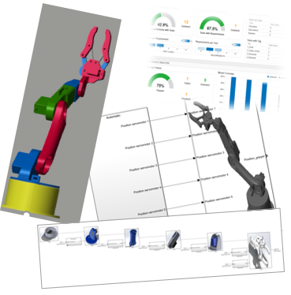
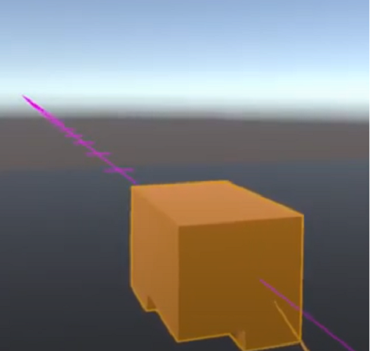

# Open Science Benchmarking for Engineering Research

This open science wiki site is a collaborative space that gathers engineering methods and tools resulting from research studies to be benchmarked for providing objective evidences that the community is making progress.

## Motivations

*Why did we start this open science environment for benchmarking engineering research?*

During the last decades, our community of researchers in engineering design has reached a general consensus:
 <blockquote> "Real progress on evaluating design methods can only be expected if preconditions such as standardized theoretical constructs, measures, data bases of empirical data, and a sufficient number of studies on specific design methods are developed." [Hein and Lamé, 2020]</blockquote>
  <blockquote> "without action to increase scientific, theoretical, and methodological rigour there is a real possibility of the field being superseded and becoming obsolete through lack of impact." [Cash, 2018]</blockquote>
  <blockquote> "There is this concern that design research does not live up to the standards of science: it is creating in a sense too many theories and models, which jeopardises the coherence of the discipline and which indicates that design research does not yet have the means to test and refute design theories and models." [Vermaas, 2014] </blockquote>
  <blockquote> "There is in design research a general concern about the quality of the testing of design theories and models. In work reflecting on the results that design research has produced, it is complained that generally accepted and effective research methods for testing design theories and models are lacking in design research, and that the discipline is fragmented in separate research strands.” [Vermaas, 2014]</blockquote>
  <blockquote> “37% of the articles reviewed did not have any validation. There needs to be more validation in the field of research in engineering design.” [Barth, A. et al. 2011]</blockquote>
  <blockquote> “A lack of common terminology, benchmarked research methods, and above all, a common research methodology are the most outstanding problems in the field.” [Blessing and Chakrabarti, 2009]</blockquote>
 

# Goals

*What does this project provide?*

This open science project has been born and developed in order to make a move for the engineering research community progress.

## News

*What's new?*

- 31/03/2021 - Atelier S.mart "Validation de nos recherches en Génie Industriel : Co-Construction d'une Feuille de Route." [Dashboard](https://miro.com/app/board/o9J_lOfryN8=/) [Notes](https://github.com/GIS-S-mart/Welcome/blob/main/Papers/20210331-Notes%20_Colloque_Smart.pdf)
- 28/01/2021 - Webinar S.mart "Méthodologies de recherche sur l'industrie du futur: Pourquoi et Comment ? [Replay](https://videos.univ-grenoble-alpes.fr/video/21692-webinar-smart-validation-des-recherches-en-conception/) [Slides](https://github.com/GIS-S-mart/Welcome/blob/main/Papers/20210324-Slides.pdf) [Notes](https://github.com/GIS-S-mart/Welcome/blob/main/Papers/20210324-Webinar_smart_validation_framapad.pdf)

## Joining the community 

If you have any questions or run into problems during your benchmarking, please search for answers and/or reach out on **Discussions**:
- [**Discussions on...** Open science Benchmarking in Engineering Research](https://github.com/GIS-S-mart/Welcome/discussions)
- [**Discussions on...** Benchmark 1 - Model-Based Systems Engineering for Validation and Verification](https://github.com/GIS-S-mart/Benchmark-1_Model-Based_Systems_Engineering_for_Validation_and_Verification/discussions/new?category=announcements&welcome_text=true)
- [**Discussions on...** Benchmark 2 - 3D Modelling in VR](https://github.com/GIS-S-mart/Benchmark-2_3D_modelling_in_VR/discussions)

- ...

Please also take a look at the list of **Open Issues**:
- [**Open Issues on...** Open science Benchmarking in Engineering Research](https://github.com/GIS-S-mart/Welcome/issues)
- [**Open Issues on...** Open Issues on Benchmark 1 - Model-Based Systems Engineering for Validation and Verification](https://github.com/GIS-S-mart/Benchmark-1_Model-Based_Systems_Engineering_for_Validation_and_Verification/issues)
- [**Open Issues on...** Open Issues on Benchmark 2 - 3D Modelling in VR](https://github.com/GIS-S-mart/Benchmark-2_3D_modelling_in_VR/issues)

- ...

If you think there is an error, please create a new issue.

## Code of Conduct

This code of conduct outlines expectations for paticipation in this Open Source Benchmarking Environment for Engineering Research. By joining our community, you pledge to act and interact in ways that contribute to an open, welcoming, diverse, inclusive, and healthy community by:
- Being radically inclusive to existing members and newcomers looking to learn or participate
- Being totally respectful of each others abilities, interests, viewpoints, experiences and personal differences
- Gracefully accepting constructive criticism and being exceedingly kind even in moments of disagreement while working towards consensus
- Educating and illuminating others with something you know more about
- Contacting the original contributors before any external communication
- Preventing any public or private business opportunities of the open source content without agreeing with the original authors and contributors of the sources

**People violating this code of conduct may be banned from the community**

## Required Background

_*What are the specific knowledge prerequisite a maker should have in order to create his own documentation based on this project?*_

To contribute to this project, you should know how to:

- [Clone a GIT repository](https://docs.github.com/en/github/creating-cloning-and-archiving-repositories/cloning-a-repository)
- [Edit a Markdown file](https://guides.github.com/features/mastering-markdown/)
- [Clone a repository](https://docs.github.com/en/github/creating-cloning-and-archiving-repositories/cloning-a-repository-from-github)
- [Commit changes](https://docs.github.com/en/github/committing-changes-to-your-project)
- [Create pull requests](https://docs.github.com/en/github/collaborating-with-pull-requests/proposing-changes-to-your-work-with-pull-requests)
- [Adress merge conflicts](https://docs.github.com/en/github/collaborating-with-pull-requests/addressing-merge-conflicts)

## Benchmarks

The open science benchmarking environment contains a set of benchmarks that aim at making technical progress objective and reproductible.

<table>
  
<tbody>
<td></td>
<td>
<h2><a href="https://github.com/GIS-S-mart/Benchmark-1_Model-Based_Systems_Engineering_for_Validation_and_Verification">Model-Based Systems Engineering for Early V&V </a></h2>

Benchmark methods and tools for the early validation and verification of engineered systems.

<strong>Keywords</strong>: MBSE, Validation, Verification, Simulation

<strong><a href="https://github.com/GIS-S-mart/Benchmark-1_Model-Based_Systems_Engineering_for_Validation_and_Verification/discussions/new?category=announcements&welcome_text=true">Discussions </a> - <a href="https://github.com/GIS-S-mart/Benchmark-1_Model-Based_Systems_Engineering_for_Validation_and_Verification/issues"> Open Issues </a>
</td>
</tbody>

<tbody>
<td></td>
<td>
<h2><a href="https://github.com/GIS-S-mart/Benchmark-2_3D_modelling_in_VR">3D modelling in Virtual Reality </a></h2>

Benchmark methods and tools for 3D modelling in virtual reality.

<strong>Keywords</strong>: Virtual Reality, Geometric Modelling

<strong><a href="https://github.com/GIS-S-mart/Benchmark-2_3D_modelling_in_VR/discussions">Discussions </a> - <a href="https://github.com/GIS-S-mart/Benchmark-2_3D_modelling_in_VR/issues"> Open Issues </a>
</td>
</tbody>
</table>
  
## Contribution Process

_*Willing to be active with us? Follow this contribution process!*_

If you want to:
- look for input on what to contribute, brows the issues with the Requests or Bug label
- create a new benchmark, post on issues page and briefly outline the new benchmark
- create a new repository to host you bencharm, fork the "template repository" by clicking on the button "Use this template"
- add/modify/remove a dataset to an existing benchmark, post on issues page and briefly outline the new dataset
- add/modify/remove a comparison criteria to an existing benchmark, post on issues page and briefly outline the new criteria
- submit your solution, post on issues page and use the field <title> to give a name to your solution
 
## Project team

_*These were the original creators of this project. Want to contact the Core Team? Send an e-mail to all of them!*_

* Romain Pinquié - Univ. Grenoble Alpes, CNRS, Grenoble INP, G-SCOP - romain.pinquie@grenoble-inp.fr {Git ID: [rpinquie](https://github.com/rpinquie)}
* Julien Le Duigou - Université de Technologie de Compiègne, Roberval - julien.le-duigou@utc.fr {Git ID: [jleduigo](https://github.com/jleduigo)}
* Lionel Roucoules - Arts et Métiers ParisTech, LISPEN - lionel.roucoules@ensam.eu {Git ID: [roucoules](https://github.com/roucoules)}
* Lou Grimal - Université de Technologie de Troyes, InSyTE, CREIDD - lou.grimal@utt.fr {Git ID: [LouGrimal](https://github.com/LouGrimal)}

## Other participants

_*This open-science repository is run by volunteers from the community. Want to be an active member of our community? Add your contact details to the list!*_

* Nabil Anwer - ENS-Paris-Saclay, LURPA - nabil.anwer@lurpa.ens-cachan.fr
* Matthieu Bricogne - Université de Technologie de Compiègne, Roberval - matthieu.bricogne@utc.fr
* Alexis Lalevée - Université de Technologie de Troyes, ICD - alexis.lalevee@utt.fr
* Florent Laroche - Ecole Centrale de Nantes, IS2N - florent.Laroche@ec-nantes.fr
* Olivia Penas - Supméca, QUARTZ - olivia.penas@supmeca.fr
* Régis Plateaux - Supméca, QUARTZ - regis.plateaux@supmeca.fr
* Alix Thecle - Arts et Métiers ParisTech, IMS - Thecle.alix@ensam.eu 
* Nadège Troussier - Université de Technologie de Troyes, ICD - nadege.troussier@utt.fr
* Esma Yahia - Arts et Métiers ParisTech, LISPEN - esma.yahia@ensam.eu
* Gilles Foucault - Université Grenoble Alpes, G-SCOP - gilles.foucault@univ-grenoble-alpes.fr {Git ID: [gilles-foucault-univ](https://github.com/gilles-foucault-univ)}

## Related projects

*What are the existing sources that have inspired this project?*

* Open science:
  - [DATACC](https://www.datacc.org/)
  - [Top 10 reasons to NOT share your code (and why you should anyway)](https://faculty.washington.edu/rjl/talks/LeVeque_CSE2011.pdf)
  - [How to describe data before publication](https://www.datacc.org/vos-besoins/documenter-ses-donnees/metadonnees/)
  - [Déposer ses données en ligne : où et comment ?](https://www.datacc.org/vos-besoins/valoriser-ses-donnees/deposer-ses-donnees-en-ligne-ou-et-comment/)
  - [OSF](https://osf.io/)
  - [Ouvrir la science](https://www.ouvrirlascience.fr/)
  - [OpenAIRE Nexus project](https://www.openaire.eu/openaire-nexus-project)
  - [DoRANum](https://doranum.fr/)
* Open access repositories:
  - [Software Heritage](https://www.softwareheritage.org/)
  - [Archive Ouverte HAL](https://data.archives-ouvertes.fr/)
  - [Zenodo](https://zenodo.org/)
  - [4TU.ResearchData](https://data.4tu.nl/info/en/)
  - [B2SHARE](https://eudat.eu/catalogue/B2SHARE)
  - [B2DROP](https://eudat.eu/catalogue/B2DROP)
  - [Harvard Dataverse](https://dataverse.harvard.edu/)
* Modelling and Simulation:
  - [PHYRE A Benchmark For Physical Reasoning](https://phyre.ai/#tasks)
  - [OMG MBSE Methodology and Metrics](https://www.omgwiki.org/MBSE/doku.php?id=mbse:methodology)
* Computer science academic challenges:
  - [Semantic Textual Similarity Wiki](http://ixa2.si.ehu.eus/stswiki/index.php/Main_Page)
  - [ICLR Reproducibility Challenge](https://reproducibility-challenge.github.io/iclr_2019/)
  - [The EPFL Combinational Benchmark Suit](https://github.com/lsils/benchmarks)
* Data science public challenges:
  - [Kaggle](https://www.kaggle.com/competitions)
  - [Challenge Data ENS](https://www.google.com/search?q=challenge+data+ens&oq=challenge+data+ens&aqs=chrome..69i57j69i65.2303j0j1&sourceid=chrome&ie=UTF-8) 
  - [Hackatons](https://www.hackateam.com/fr/challenges)
* Shape retrieval:
  - [Princeton shape retrieval and analysis group](https://gfx.cs.princeton.edu/proj/shape/)
  - [Shape retrieval contest for CAD models](https://engineering.purdue.edu/PRECISE/shrec08)
  - [3D shape retrieval challenge](https://www.shrec.net/)
* Model exchange:
  - [OMG Model Interchange Wiki](https://www.omgwiki.org/model-interchange/doku.php)
  - [The NIST Validator](http://validator.omg.org/se-interop/tools/validator)

## Related papers

*Want to learn more about the validation in engineering research? Here is a list of sources to start with!*
- Hein, A. M. and Lamé, G. (2020) [Evaluating engineering design methods: taking inspiration from software engineering and the health sciences](https://hal.archives-ouvertes.fr/hal-02866692)
- Gericke, K. et al. (2020) [Supporting designers: moving from method menagerie to method ecosystem](https://www.cambridge.org/core/journals/design-science/article/supporting-designers-moving-from-method-menagerie-to-method-ecosystem/63DA0F12D7C5AB2D94DDFBE40DD7E8ED)
 - Ureten, S et al. (2020) [Current challenges and solution approaches in empirical engineering design research - A workshop for empirical research](https://www.cambridge.org/core/journals/proceedings-of-the-design-society-design-conference/article/current-challenges-and-solution-approaches-in-empirical-engineering-design-research-a-workshop-for-empirical-research/D19541606DDACCE6741D8F47E8B650B7)
- Isaksson, O. et al. (2020) [You need to focus to validate](https://www.cambridge.org/core/journals/proceedings-of-the-design-society-design-conference/article/you-need-to-focus-to-validate/B8301671F8388D4EFED8D4EFE15500D4)
- Cash, P. (2018) [Developing theory-driven design research](https://www.sciencedirect.com/science/article/abs/pii/S0142694X18300140)
- Panchal, J. H. and Szajnfarber (2017) [Experiments in systems engineering and design research](https://onlinelibrary.wiley.com/doi/abs/10.1002/sys.21415)
- Vermaas, P. E. (2014) [Design theories, models and their testing: On the scientific status of design research](https://link.springer.com/chapter/10.1007/978-1-4471-6338-1_2)
- Barth, A., Caillaud, E., and Rose, B. (2011) [How to validate research in engineering design?](https://www.designsociety.org/publication/30456/HOW+TO+VALIDATE+RESEARCH+IN+ENGINEERING+DESIGN%3F)
- Blessing, L. and Chakrabarti, A. (2009) [DRM, a Design Research Methodology](https://www.springer.com/gp/book/9781848825864)
- Frey, D. D. and Dym, C. L. (2006) [Validation of design methods: lessons from medicine](https://link.springer.com/article/10.1007/s00163-006-0016-4)
- Seepersad, C. C. and al. (2006) [The validation square: How does one verify and validate a design method?](https://asmedigitalcollection.asme.org/ebooks/book/103/chapter-abstract/22576/The-Validation-Square-How-Does-One-Verify-and?redirectedFrom=fulltext)
- Eckert, C. M. et al. (2003) [The spiral of applied research: A methodological view on integrated design research](https://www.designsociety.org/publication/23944/THE+SPIRAL+OF+APPLIED+RESEARCH%3A+A+METHODOLOGICAL+VIEW+ON+INTEGRATED+DESIGN+RESEARCH)

## Disclaimer

Reference herein to any specific commercial product, process, or service by trade name, trademark, manufacturer, or otherwise, does not constitute or imply its endorsement by our community or S.mart.

## License

 This work is licensed under a <a rel="license" href="http://creativecommons.org/licenses/by-nc-sa/4.0/">Creative Commons Attribution-NonCommercial-ShareAlike 4.0 International License</a>.

## Sponsors and Partners

- [S.mart - Systems.Manufacturing.Academics.Resources.Technologies](https://s-mart.fr/)

